北邮信通导论课进阶实验 - Node JS + Mongodb + 微信小程序开发者接口
===

# 后端的必要性

在[云函数](https://www.oursparkspace.cn/?yada_wiki=1541583107)我们大致了解了业务逻辑的处理并不在手机上进行，所以采用了方便快捷的云函数。但是并不是所有的功能都能够通过云函数实现，所以往往在大多是的生产中，都采用自己搭建服务器作为整个服务的后端。

而且各位应该都已经注册了自己人生中第一个域名以及租赁了人生中第一台服务器，怎么能放着不用呢？通过自己的努力，让他们变得实用起来吧！

没有购买域名或者域名由于没有通过实名认证并不能使用的可以在Freenom注册免费域名（不能备案）进行尝试，没有购买服务器请参考之前的教程租赁学生服务器。

# 目标速览

初始化： 在远程的mongodb上插入一条数据
<!-- TODO: 插入图片 mongo-express 后台图片 -->

有一个表单，里面有一个输入框组件用来输入内容，点击提交按钮以修改云数据库里content字段。还有一个显示区域用于从云数据库读取上面的记录，点击读取按钮成功读取记录后把content字段的值显示在下面。

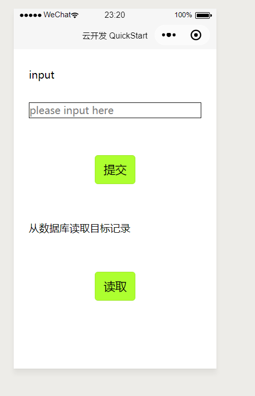

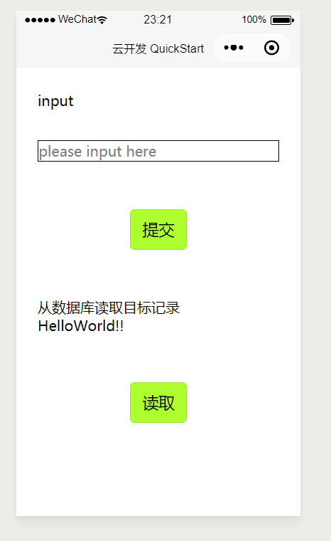

在输入框里输入新的字符串

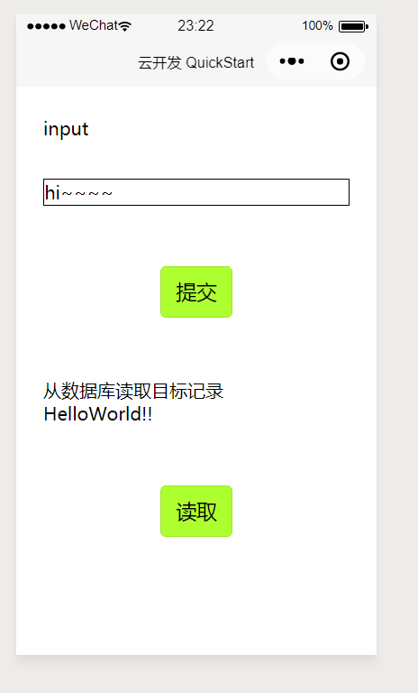

点击提交，更新记录成功后清空输入框。再点击读取按钮，把该记录的content字段的值显示在下面。

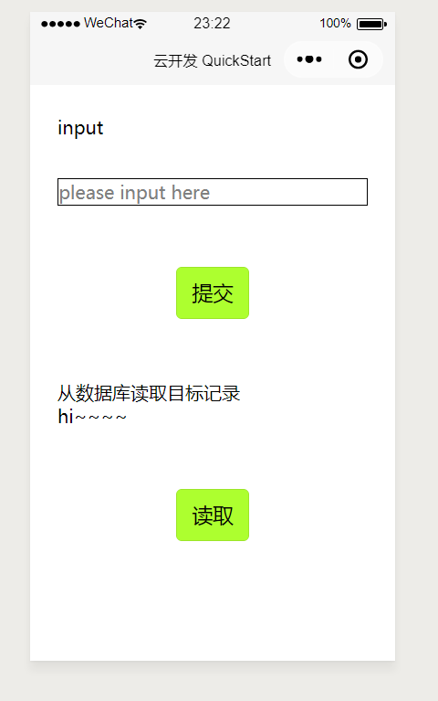

<!-- PS: TODO: 上面的图片需要更换 -->

# 总体框架

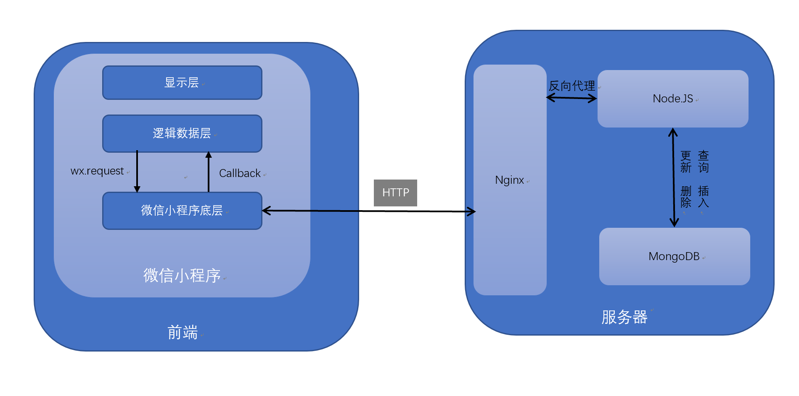

整体请求流程大概是这样的：

1. 用户点击按钮出发事件 @显示层
2. js文件调用wx.request @数据逻辑层
3. 微信小程序底层开始建立TCP连接，发送HTTP报文 @微信小程序底层
4. 后台Nginx(是一个高性能的HTTP和反向代理服务)解析HTTP请求并转发给Nodejs处理 @Nginx
5. Nodejs处理请求，向MongoDB发出对应的操作指令 @NodeJS
6. MongoDB处理请求并返回数据 @MongoDB
7. Nodejs收到请求返回给Nginx @Nodejs
8. Nginx收到Nodejs回复，发送HTTP回应给请求者 @Nginx
9. 微信小程序底层收到TCP数据并解析HTTP返回数据返回给对应的回调函数 @微信小程序底层
10. 微信小程序js文件的回调函数被调用，更新数据等 @数据逻辑层
11. 界面刷新或者产生提示信息 @显示层

# 搭建服务器的主要功能点

- Nginx： 配置服务器的Nginx 使其能够正确的处理请求
- Nodejs： 能够上传代码到远程服务器并使其能够正确运行
- Mongodb： 在远程运行数据库并顺便使之可以使用简单的web管理界面进行管理

主要难点：

- 远程访问服务器使用命令行，学习如何使用帮助来使用这些命令。
- 修改各种文件中的配置，使之符合客观事实。

# 服务器搭建

目标： 使得自己的服务器能够正常工作

## step1.连接自己的服务器

### 下载客户端

这里推荐使用[MobaXterm](https://mobaxterm.mobatek.net/)虽然是英文界面，但是可以使用sftp进行文件管理，免去了上传文件的痛苦。

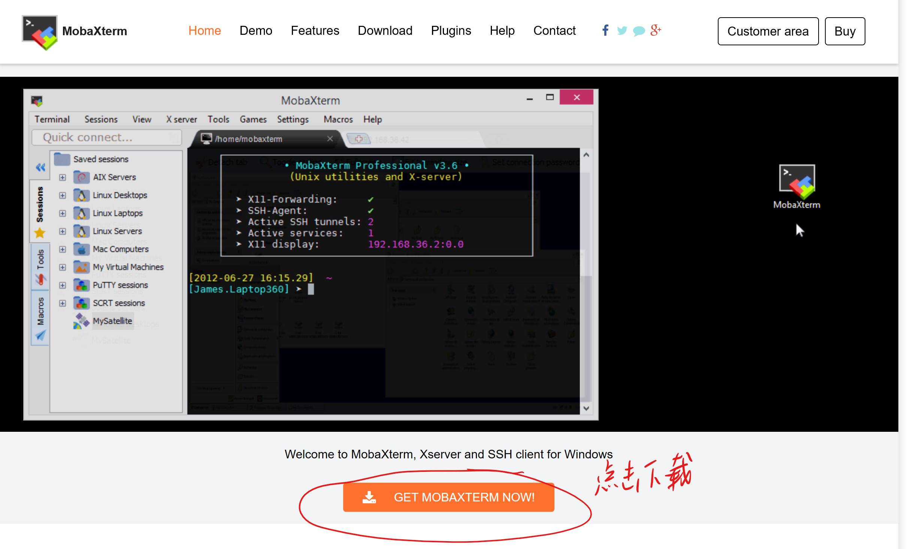

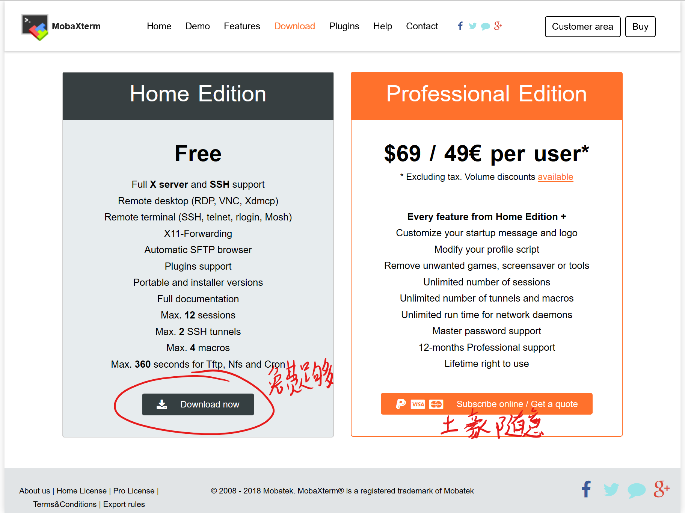

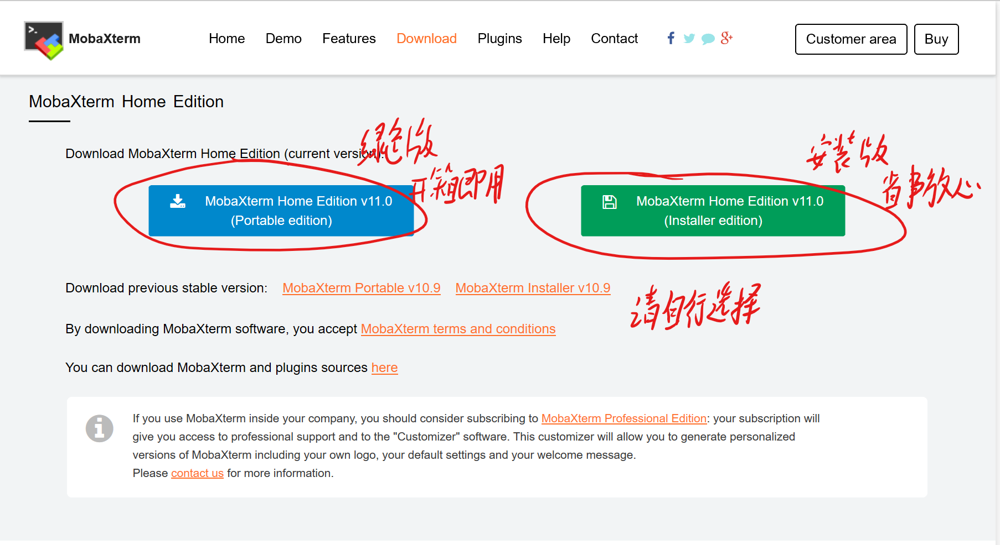

### 安装

#### 绿色版:


#### 安装版

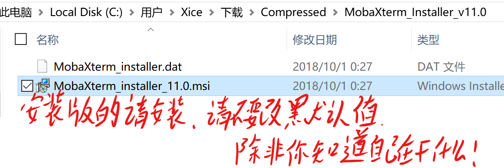


### 运行

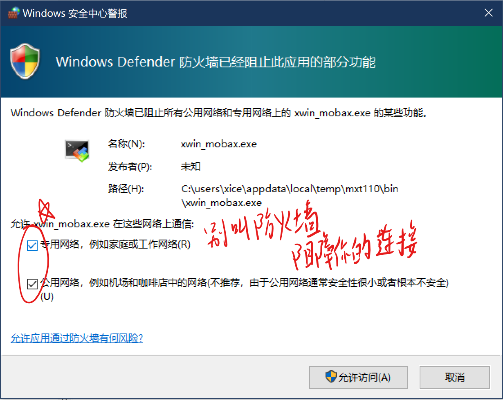

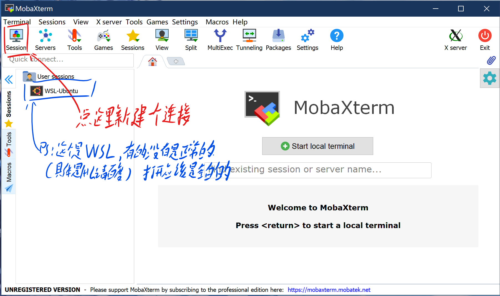

**下面的教程面向Ubuntu/Debian系统** 如果不是请去腾讯云进行重装

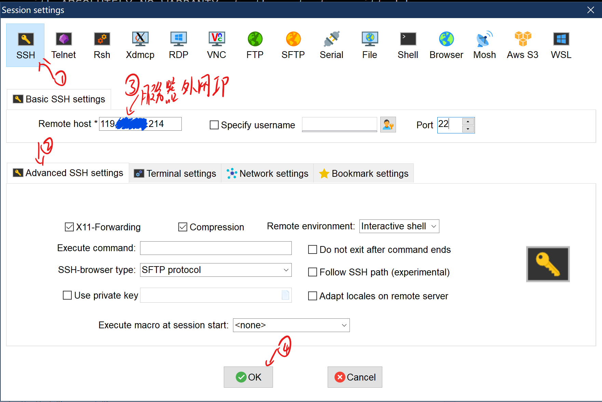

这个软件非常强大，自己可以摸索（百度）一下如何使用。

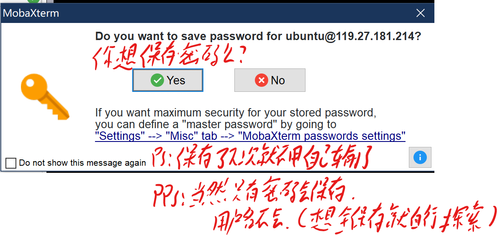

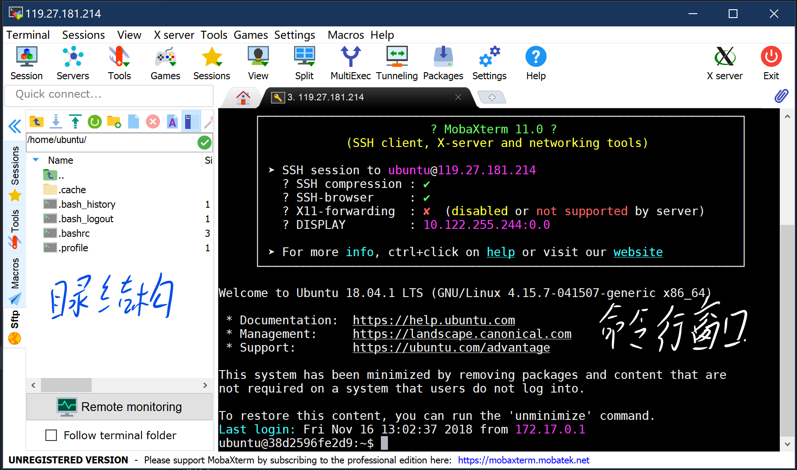

之后我们就可以愉快的进行系统配置了！

## step2.安装所有的软件

既然是命令行，那么所有的操作都可以通过命令行完成。

更新软件库

```bash
$ sudo apt update
```

> tip: 通常教程或者书本在写命令的时候都会在命令起那面添加一个$或者#。$代表是以普通的用户身份运行，#代表使用管理员权限运行。后面的内容才是命令本身，如果粘贴的时候带上$会报错呦。

安装一波软件

```bash
$ sudo apt install vim git curl wget htop unzip tree nginx mongodb nodejs npm -y
```

然后就是漫长的安装过程，这个时候我们可以研究一下这都是什么东西。

- vim ： 大名鼎鼎的文本编辑器，什么你没听说过，那就是因为他生活在命令行次元，和可视化的不是一个次元，到底有多又名呢？可以去百度一下。你可以用它在服务器上临时编辑一些文本，方便的很。
- git ： 非常好用的，全世界通用的代码管理软件，相信你不会不知道吧。
- curl ： 用来发送http请求的工具，用它来调试网络api再好不过了。
- wget ： 基本上同上，但是倾向于把文件下载下来。
- unzip : 用来解压文件的工具
- htop ： linux的任务管理器，可以看看现在有什么程序正在运行。
- nginx ： 我们的主角nginx服务
- mongodb ： 我们亲爱的数据库
- nodejs ：不用再介绍了吧
- npm : 非常好用的包管理器，配合node食用味道更加

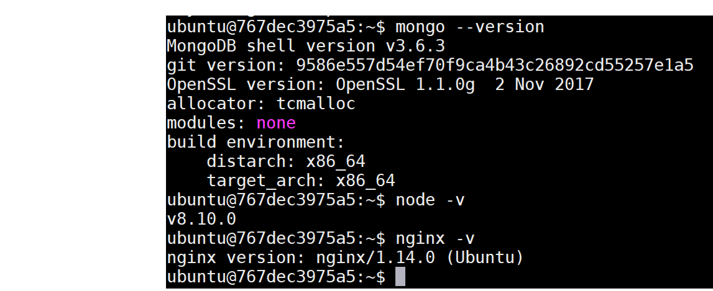

## step3.上传代码

**WARRING** Linux可脾气没有Windows好，文件别瞎放了，小心Linux....


> 在参加芬兰的阿尔托大学举办的活动时，Linus Torvalds与同学们进行了互动。当一个学生问道，怎么样能让Linux运行在自己的采用NVIDIA显卡的Optimus笔记本上，Torvalds发飙了，直接转向摄像头，竖起中指，破口大骂：“NVIDIA，Fuck You”。当时大家就震惊了。

一笑而过，建议各位在操作什么路径的时候，先了解一下这个路径的意义，再瞎搞可就真的凉了。

> - /bin 二进制可执行命令
> - /dev 设备特殊文件
> - /etc 系统管理和配置文件
> - /etc/rc.d 启动的配置文件和脚本
> - /home 用户主目录的基点，比如用户user的主目录就是/home/user，可以用~user表示
> - /lib 标准程序设计库，又叫动态链接共享库，作用类似windows里的.dll文件
> - /sbin 系统管理命令，这里存放的是系统管理员使用的管理程序
> - /tmp 公用的临时文件存储点
> - /root 系统管理员的主目录（呵呵，特权阶级）
> - /mnt 系统提供这个目录是让用户临时挂载其他的文件系统。
> - /lost+found 这个目录平时是空的，系统非正常关机而留下“无家可归”的文件（windows下叫什么.chk）就在这里
> - /proc 虚拟的目录，是系统内存的映射。可直接访问这个目录来获取系统信息。
> - /var 某些大文件的溢出区，比方说各种服务的日志文件
> - /usr 最庞大的目录，要用到的应用程序和文件几乎都在这个目录。其中包含：
> - /usr/X11R6 存放X window的目录
> - /usr/bin 众多的应用程序
> - /usr/sbin 超级用户的一些管理程序
> - /usr/doc linux文档
> - /usr/include linux下开发和编译应用程序所需要的头文件
> - /usr/lib 常用的动态链接库和软件包的配置文件
> - /usr/man 帮助文档
> - /usr/src 源代码，linux内核的源代码就放在/usr/src/linux里
> - /usr/local/bin 本地增加的命令
> - /usr/local/lib 本地增加的库

虽然看着多，到时候用到了再来查。

Q: 不知道自己在什么路径怎么办呢？

A: 一般有两种办法

1. bash这个shell里的命令提示符中可以知道

```
ubuntu@767dec3975a5:~$
```

这就是一个bash的命令提示符，用来提醒你可以输入新的命令。它由几部分组成。`用户名@主机名:当前路径$`。`~`是一个环境变量HOME的缩写，一般用户的HOME都指向`/home/用户名`。

关于www的路径就是`/var/www`。熟练的使用`cd`和`ls`（类似于windows的`dir`）命令可以让你知道“我是谁”，“我在哪”，“我在干什么”的哲学三问。

2. 使用 `pwd` 命令，直接返回你当前所在的绝对路径。

tip:

- `cd`:后面直接跟路径就是了，linux下面没有盘符的概念，所以想去哪里就直接一个cd过去。

    路径分为绝对路径和相对路径。

    - “绝对路径”： 就是指向位置不随当前位置以及调用环境改变而改变的路径，一般上是`/`开头，从根目录开始一直到所需要的位置的完整路径。
    - “相对路径”： 不同于绝对路径，相对路径是再当前位置或者环境变量的基础上进行索引的。

    在每个路径下面都会两特殊的文件 `.` 和 `..`

    - “.”： 指向当前路径
    - “..”： 指向上级路径
- `ls`: 列出当前目录的文件列表。
    
    常用参数：

    - -l : 略出详细信息，包括大小 所有者 所有用户组 权限设置
    - -a : 列出所有文件，包括上面提到的两个特殊文件。以及隐藏文件

这两个命令可以自己尝试一下，这都是读取的命令，不同担心造成什么损坏，到处转转看看不同的路径里面有什么文件，

了解的差不多我们就可以开始上传代码了。

**PS**：当然上传代码的方式可谓是八仙过海各显神通了。下面简单描述一下几种方式，然后详细介绍一种方式。

1. 利用git： 首先将自己的代码传到远程的git仓库（githua、gitlab等等）然后使用刚才安装的git工具clone下来。
2. 利用网盘： 你可以在自己的服务器上面建一个网盘，然后直接通过网站上传。
3. 利用复制粘贴： 你也可以把所有代码一个一个文件复制过去，当然，这需要一定的耐心。
4. 使用sftp上传（详细）：使用ssh自带的sftp上传文件。

我们详细的来讲讲第4种方式。

当然我想各位应该已经看到了左边这个目录，双击`..`就可以到上一个目录，或者直接在上面的路径框输入想去的路径回车就可以到了（类似于`cd`）。然后直接显示在这里相当于`ls`。

先将需要上传的代码修改好，然后打包成一个`.zip`格式的zip压缩包直接拖拽到空白的地方就可以上传了就可以进行上传。

<!-- TODO: 上传文件的图片 -->

当然，作为一个普通用户，做好的存放地点当然是自己的“HOME”

**思考**：为什么需要打包之后再上传呢？为什么不直接拖拽文件夹呢？（好奇的你可以试一试）

然后我们对这个压缩包进行解压。

```bash
$ unzip server.zip
```

请自己替换需要解压的文件文件名，如果觉得自己一个一个字符输入十分费劲，也可以试一试Tab补全。只输入文件名的一部分然后按一下Tab你就会发现文件名自己补全了。当然如果不会自动补全有可能是因为根本不存在这个开头的文件，或者是以这个开头的文件不止一个，后者再按一下tab会在下面列出所有可能的结果，当然不能太多。

<!-- TODO: Tab使用的动图 -->

然后进入到这个文件夹里安装所需要的依赖

```
$ npm i
```

PS: `i` 就是`install`参数的简写，平时也可以用，程序员可是非常懒的，常用的命令字符能少一个是一个。

然后运行

```
$ npm run start
```

为什么这个跟平时使用的`node app.js`不太一样呢？之前你只能说是运行一个脚本，现在你就可以说运行的是一个项目了！使用包管理器来管理你的项目，更加规范。

当然这并不是白来的，这种操作也需要严格的定义，相关配置文件就是`package.json`。想要更深层了解的同学可以百度：“npm run”来了解其工作形式，或者直达：[npm脚本命令npm run script的使用](https://www.cnblogs.com/zhaozhipeng/p/8269403.html)进行学习。

好的看到没有什么 红色的ERR! 就是完成运行了。

接下来我们来配置nginx

